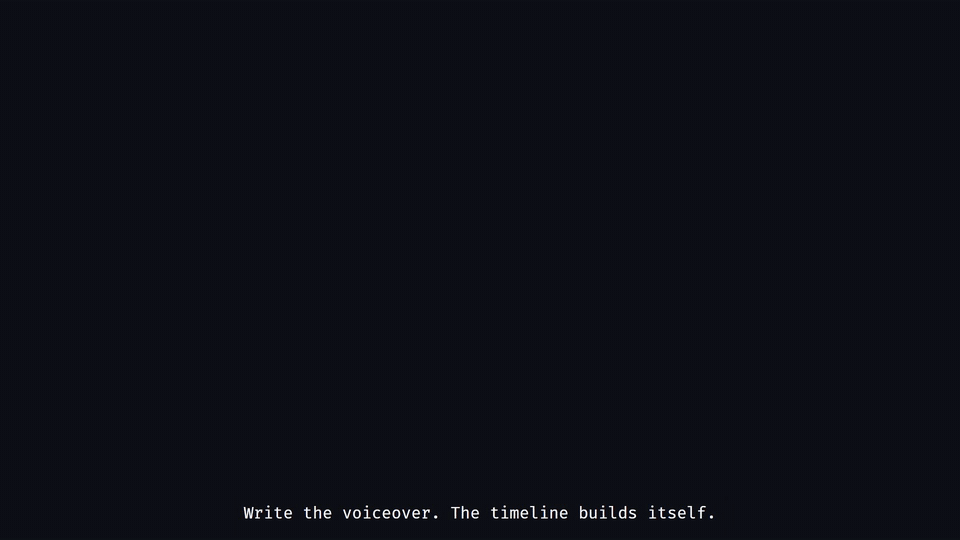

# clipscript

Narration-driven, clip-based videos for programming tutorials and dev-logs.
You write the voiceover; the timeline builds itself.



## The idea

- **The subtitle script is the master clock.** One flat `subtitles.toml` of
  id'd lines; the text is shown as subtitles and spoken by TTS, and line
  durations (measured from the generated voiceover) pace the whole video.
- **Visuals are modular clips** anchored to line ids, never to hand-computed
  frames: code panes with Code Hike morphs and annotations, terminals,
  recordings, titles, lists, callouts.
- **A storyboard is a typed TS object**, so malformed episodes fail at write
  time, and the timeline compiler fails loudly on anything that doesn't
  resolve.

## Install

Use the **Use this template** button on GitHub, or:

```bash
npx degit JerryAZR/clipscript-template my-video
cd my-video
npm i
```

## Quickstart

```bash
npm run dev   # Remotion Studio; the examples/ folder holds the demo episodes
```

Your own episode: write `public/<episode>/subtitles.toml`, generate voiceover
(`npx tsx scripts/tts.mts --episode <episode>`), write
`src/episodes/<episode>/storyboard.ts`, register it in
`src/episodes/registry.ts`, render with `npx remotion render <episode>`.

The full authoring workflow lives in
[`.agents/skills/episode-authoring/`](.agents/skills/episode-authoring/SKILL.md);
project conventions in [`AGENTS.md`](AGENTS.md).

## What's inside

The `examples/` episodes are reference material — keep them while learning,
delete them in your own copy:

- **showcase** — the polished ad for the framework; what the engine can do
- **code-tutorial** — a realistic tutorial slice; the authoring reference
- **clip-gallery** — one line per clip type; a visual catalog
- **diff-tool** — the `annotate-diff` workflow: diff views generated from
  pristine file versions
- **readme-teaser** — the short four-scene episode used to generate the GIF above

## Built for AI agents

The repo ships structured agent context: `AGENTS.md` for always-on
conventions and task-scoped skills under `.agents/skills/` (authoring
episodes, writing custom clips, engine internals). Point your coding agent
at the repo and it knows how to make a video.

## Commands

- `npm run dev` — Remotion Studio
- `npm test` — unit + render smoke tests
- `npm run lint` — tsc + eslint
- `npx remotion render <Comp>` — render a video
